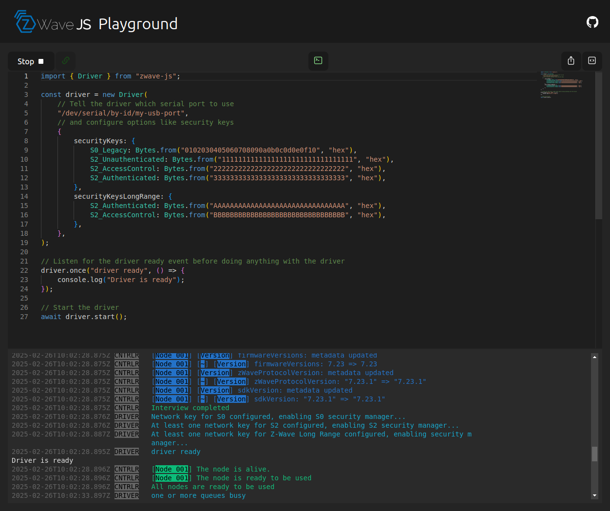

# Z-Wave JS Playground

An interactive, browser-based sandbox to build and test scripts to interact with a Z-Wave controller.

**Fully-local:** All code is executed locally in your browser, and is **not** sent to any server. Only type declarations are fetched from [jsDelivr](https://www.jsdelivr.com/).

**Rich editor:** The built-in editor provides syntax highlighting, code completion, and error checking.

**Sharing and embedding:** Share your scripts with others by copying the URL, or embed them in an iframe your own website.



## How it works

- [esbuild](https://esbuild.github.io/) is used to pre-bundle Z-Wave JS while eliminating browser-incompatible dependencies and transpile your TypeScript code in the browser
- [Monaco Editor](https://microsoft.github.io/monaco-editor/) powers the code editor
- [TypeScript](https://www.npmjs.com/package/typescript) and [@typescript/ata](https://www.npmjs.com/package/@typescript/ata) are used to automatically download the type definitions
- [@zwave-js/bindings-browser](https://www.npmjs.com/package/@zwave-js/bindings-browser) allows Z-Wave JS to use the browser's Web Serial and storage APIs

When you press **Run**, the code is transpiled locally using `esbuild`. The playground hooks it up to a serial port (requires a Chromium-based browser) and executes it. The browser console output is redirected to the console panel.

Some of these dependencies are pretty big (roughly 30 MB total), so the initial load might take a while. When embedded, the playground will ask first whether it should load the dependencies.

## Embedding

You can embed the playground in your own website using an iframe. Click the **Embed** button to get the URL for the iframe. Because the playground requires access to the serial port, these permissions must be granted explicitly:
```html
<iframe allow="serial" src="..."></iframe>
```

We recommend a height of at least `750px` for the iframe.